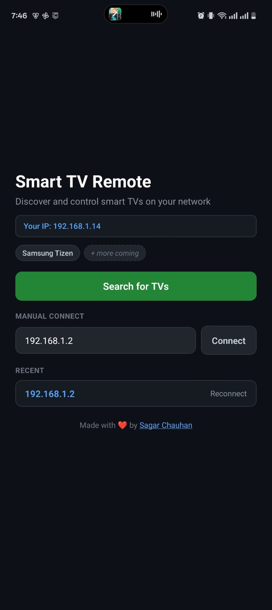
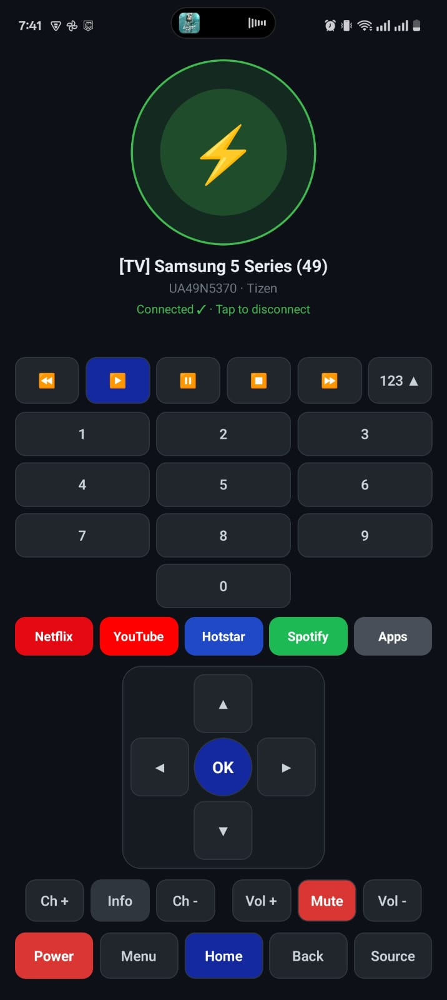

# Universal TV Remote

An open-source, modular smart TV remote control app built with React Native. Discover and control smart TVs on your local Wi-Fi network from your phone.

## Screenshots

| Discovery | Remote |
|-----------|--------|
|  |  |

The remote UI is **deliberately minimal**: instead of cramming every possible button onto the screen, it shows only the controls you use most on a smart TV—power, D-pad navigation, volume, home, back, and media transport. That keeps the layout uncluttered and one-handed friendly, so you can change channels or open apps without hunting for tiny keys.

## Features

- **Auto-discovery** — Scans your local network via SSDP to find smart TVs automatically
- **One-tap connect** — Select a TV and start controlling it instantly
- **Quick reconnect** — Remembers your last TV for instant re-connection
- **Manual IP** — Enter a TV's IP address if auto-discovery doesn't find it
- **Full remote** — Power, navigation (D-pad), volume, channels, number pad, and media transport controls
- **App shortcuts** — Netflix, YouTube, Hotstar, Spotify, and Voice (placeholder for future)
- **Token persistence** — Pair once, connect automatically next time (Samsung)
- **Modular handler system** — Extensible architecture makes it easy to add support for any TV brand

---

## Compatibility

### Currently Supported

| Brand | Models | OS | Protocol | Port | Status |
|-------|--------|----|----------|------|--------|
| **Samsung** | 2016+ (K-series onward) | Tizen | WebSocket (`ms.remote.control`) | 8002 (wss) / 8001 (ws) | **Fully supported** |

### Planned / Community Contributions Welcome

| Brand | Models | OS | Protocol | Port | Difficulty |
|-------|--------|----|----------|------|------------|
| **LG** | 2014+ | WebOS | SSAP over WebSocket | 3000 / 3001 | Medium |
| **Roku** | All Roku TVs & devices | Roku OS | ECP (HTTP REST) | 8060 | **Easy** — just HTTP |
| **Android TV** | Sony, TCL, Xiaomi, Philips, etc. | Android TV | gRPC / Protobuf over TLS | 6466 | Hard — binary protocol |
| **Vizio** | SmartCast TVs | SmartCast | REST API with auth | 7345 / 9000 | Medium |
| **Amazon Fire TV** | All Fire TV devices | Fire OS | ADB | 5555 | Medium |

### Not Supported

| Type | Reason |
|------|--------|
| Samsung pre-2016 (J-series, older) | Uses legacy TCP binary protocol on port 55000 — different protocol entirely |
| Non-smart TVs | No network capability |
| TVs on different Wi-Fi networks | Must be on the same LAN |

---

## How It Works

```
┌─────────────────────────────────────┐
│         SSDP Discovery              │  Multicast 239.255.255.250:1900
│   (finds all smart devices on LAN)  │  Works for ALL brands
└──────────────┬──────────────────────┘
               │
               ▼
┌─────────────────────────────────────┐
│       Handler Registry              │  Each discovered IP is probed
│   (identifies brand via REST API)   │  by all registered handlers
└──────────────┬──────────────────────┘
               │
    ┌──────────┼──────────┬──────────────┐
    ▼          ▼          ▼              ▼
┌────────┐ ┌───────┐ ┌────────┐  ┌────────────┐
│Samsung │ │ LG    │ │ Roku   │  │ Android TV │
│Tizen   │ │ WebOS │ │ ECP    │  │ gRPC       │
│WS:8002 │ │WS:3001│ │HTTP:8060│ │ TLS:6466  │
└────────┘ └───────┘ └────────┘  └────────────┘
     ✅        🔜        🔜           🔜
```

---

## Quick Start

### Prerequisites

- Node.js >= 20
- Android Studio (for Android build)
- An Android phone on the same Wi-Fi as your TV
- USB debugging enabled on your phone

### Install & Run

```bash
# Clone the repo
git clone https://github.com/yourusername/universal-tv-remote.git
cd universal-tv-remote

# Install dependencies
npm install

# Run on Android device
npx react-native run-android

# Or use the refresh script (clears cache + deploys)
./scripts/refresh-app.sh
```

### Usage

1. Open the app on your phone
2. Tap **Search for TVs** — discovered TVs appear with brand, model, and IP
3. Tap **Connect** on your TV
4. **First time only (Samsung):** Accept the pairing prompt on the TV screen
5. Use the remote: D-pad, volume, channels, number pad, and app shortcuts (Netflix, YouTube, Hotstar, Spotify, Voice). Voice is a placeholder for a future update.

### Tests

Unit tests cover the handler layer (key mappings, registry, Samsung Tizen handler):

```bash
npm test
```

Tests live in `__tests__/handlers/` and validate:

- **keys.test.ts** — Samsung key map has every standard key, maps to `KEY_*` codes, supported keys/groups are consistent
- **registry.test.ts** — Handler registration, connect/sendKey/sendRawKey/launchApp delegation, disconnect
- **SamsungTizenHandler.test.ts** — `identify()` (REST probe), `sendKey`/`sendRawKey`/`launchApp` delegation to native module, supported keys/groups

---

## Architecture

The app uses a **handler pattern** that makes adding new TV brands straightforward:

```
src/
├── handlers/
│   ├── types.ts                  # Core interfaces (TvHandler, TvDevice, StandardRemoteKey)
│   ├── registry.ts               # Handler registry — auto-selects the right protocol
│   ├── index.ts                  # Public API barrel export
│   ├── samsung/
│   │   ├── SamsungTizenHandler.ts  # Samsung Tizen implementation
│   │   └── keys.ts                 # Samsung key code mappings
│   └── _template/
│       └── TemplateHandler.ts      # Copy this to create a new handler
├── context/
│   └── TvContext.tsx              # React context (brand-agnostic)
├── screens/
│   ├── DiscoveryScreen.tsx        # Network scan + device list
│   └── RemoteScreen.tsx           # Universal remote control UI
└── native/
    └── SamsungTvNative.ts         # Native bridge for Samsung WebSocket
```

### Key Interfaces

```typescript
// Every handler implements this interface
interface TvHandler {
  brand: TvBrand;
  displayName: string;

  identify(ip: string): Promise<TvDevice | null>;  // Probe an IP to check if it's your brand
  connect(device: TvDevice): Promise<void>;         // Establish control session
  disconnect(): Promise<void>;                       // Tear down session
  sendKey(key: StandardRemoteKey): Promise<boolean>; // Send a remote command
  getSupportedKeys(): StandardRemoteKey[];           // What keys does this brand support?
}

// Standard keys work across ALL brands
type StandardRemoteKey =
  | 'power' | 'volume_up' | 'volume_down' | 'mute'
  | 'up' | 'down' | 'left' | 'right' | 'enter'
  | 'home' | 'menu' | 'back' | 'info'
  | 'channel_up' | 'channel_down'
  | 'num_0' ... 'num_9'
  | 'play' | 'pause' | 'stop' | 'rewind' | 'fast_forward';
```

---

## Adding a New TV Brand

Adding support for a new TV brand takes 5 steps:

### Step 1: Copy the template

```bash
cp -r src/handlers/_template src/handlers/your_brand
mv src/handlers/your_brand/TemplateHandler.ts src/handlers/your_brand/YourBrandHandler.ts
```

### Step 2: Add your brand to the type system

In `src/handlers/types.ts`, add your brand to the `TvBrand` union:

```typescript
export type TvBrand =
  | 'samsung_tizen'
  | 'lg_webos'
  | 'your_brand'   // ← Add this
  | 'unknown';
```

### Step 3: Implement the handler

Edit `YourBrandHandler.ts`:

- **`identify(ip)`** — Probe the IP to check if it's your brand (e.g., hit a known REST endpoint)
- **`connect(device)`** — Establish a control session (WebSocket, HTTP, etc.)
- **`sendKey(key)`** — Map `StandardRemoteKey` to your brand's native key codes and send them
- **`disconnect()`** — Clean up

Create a `keys.ts` with the key mappings.

### Step 4: Register the handler

In `src/handlers/registry.ts`:

```typescript
import { YourBrandHandler } from './your_brand/YourBrandHandler';
registry.register(new YourBrandHandler());
```

### Step 5: Done!

The discovery screen and remote control screen automatically adapt. No UI changes needed.

### Tips for Implementers

- **Roku is the easiest** to implement — it's just HTTP POST to `http://<ip>:8060/keypress/<key>`
- **LG WebOS** uses WebSocket (like Samsung) but with the SSAP protocol and a different handshake
- **Android TV** is the hardest — it uses gRPC/Protobuf over TLS with certificate-based pairing
- If your protocol requires native code (e.g., for binary protocols or TLS with self-signed certs), add a native module in `android/app/src/main/java/com/samsungremote/` and call it from your handler
- For pure HTTP/WebSocket protocols, you can implement everything in TypeScript — no native code needed

---

## POC / Testing Scripts

The `poc/` directory contains standalone Python scripts for testing TV connectivity without the mobile app:

```bash
# Create virtual environment (one-time)
python3 -m venv .venv
source .venv/bin/activate
pip install websocket-client

# Discover and test Samsung TV
python3 poc/tv_remote_poc.py

# Validate OTT (Netflix via KEY_NETFLIX, YouTube/Spotify via app launch, etc.)
python3 poc/tv_remote_poc.py --ott

# Launch app by name or Tizen app ID (YouTube, Spotify; Netflix uses KEY_NETFLIX in the app)
python3 poc/tv_remote_poc.py --launch youtube
python3 poc/tv_remote_poc.py --launch spotify

# Send specific keys
python3 poc/tv_remote_poc.py VOLUP VOLDOWN MUTE HOME
python3 poc/tv_remote_poc.py KEY_NETFLIX KEY_APP_LIST
```

---

## Android Permissions

| Permission | Purpose |
|-----------|---------|
| `INTERNET` | WebSocket / HTTP connections to TVs |
| `ACCESS_NETWORK_STATE` | Detect Wi-Fi connectivity |
| `CHANGE_WIFI_MULTICAST_STATE` | SSDP multicast discovery |

---

## Security Notes

- Samsung TVs use **self-signed TLS certificates** for port 8002. The app trusts all certificates for local LAN connections. This is standard practice for LAN TV control but should not be used on untrusted networks.
- Pairing tokens are stored locally on the device (SharedPreferences) and are never transmitted outside the LAN.
- This app operates **LAN-only** — no internet connection is required for TV control.

---

## Troubleshooting

| Issue | Solution |
|-------|---------|
| **No TVs found** | Ensure TV is on and on the same Wi-Fi. Try manual IP entry. Check if your router has AP isolation enabled. |
| **Connection fails** | Accept the pairing prompt on the TV (Samsung). Ensure port 8002 is reachable. |
| **TV doesn't respond to keys** | Confirm the TV model is supported. Try core navigation keys first. Some keys vary by model/region. |
| **Token keeps resetting** | Clear app data and re-pair. Some TV firmware updates invalidate tokens. |

---

## License

MIT

---

## Contributing

Contributions are welcome! The easiest way to contribute is by adding support for a new TV brand. See the [Adding a New TV Brand](#adding-a-new-tv-brand) section above.

When contributing:
1. Follow the handler pattern — don't add brand-specific code to the screens or context
2. Test with a real TV if possible
3. Update this README's compatibility table
4. Keep the handler self-contained in its own directory
